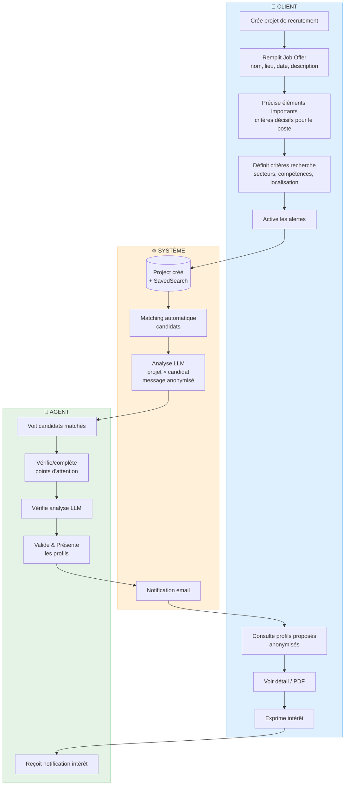
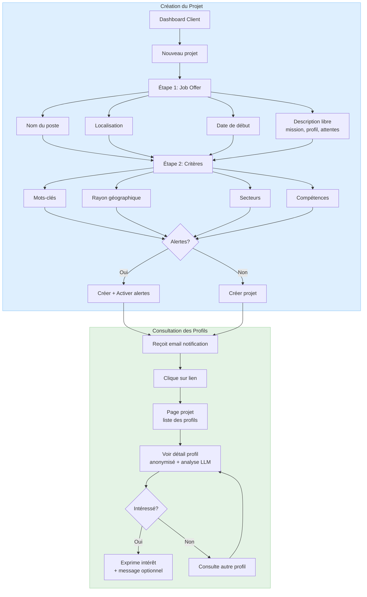
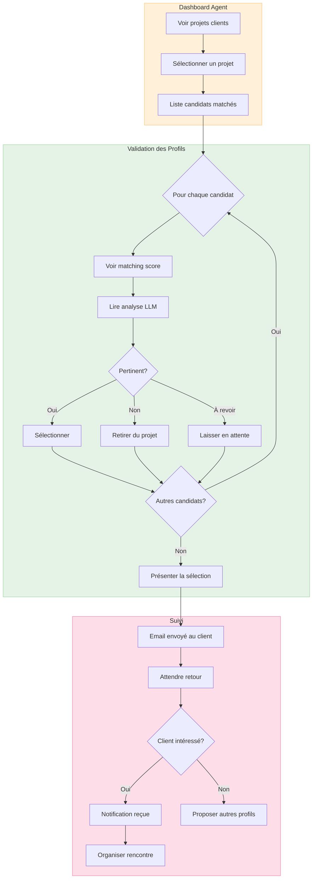
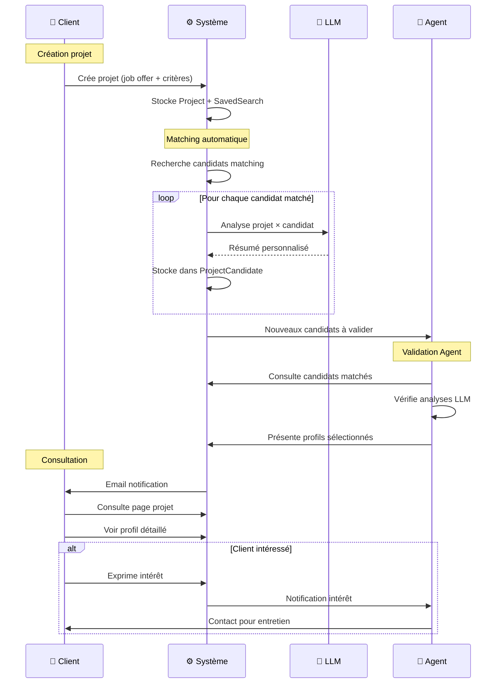
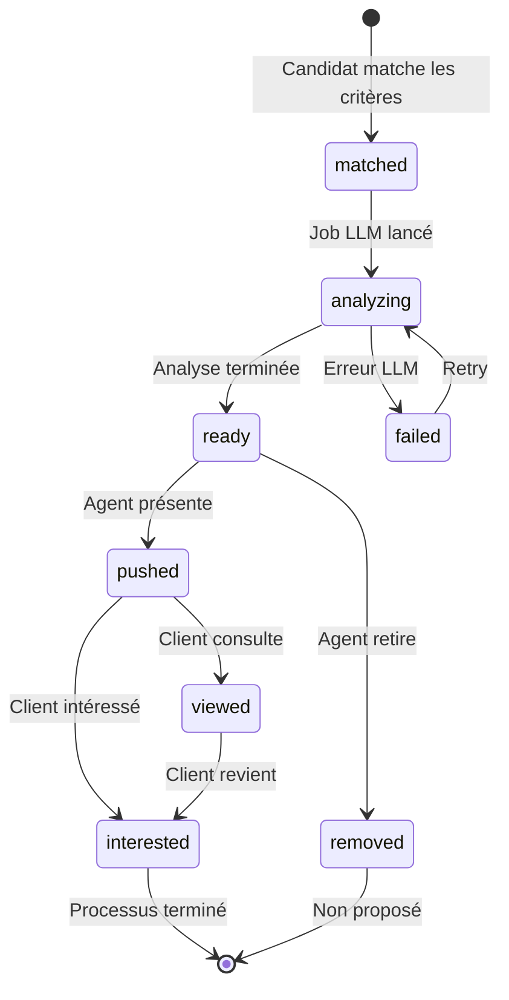

# Flow Projet de Recrutement

## Vue d'ensemble

```mermaid
flowchart TB
    subgraph CLIENT["🏢 CLIENT"]
        C1[Crée projet de recrutement]
        C2[Remplit Job Offer<br/>nom, lieu, date, description]
        C2b[Précise éléments importants<br/>critères décisifs pour le poste]
        C3[Définit critères recherche<br/>secteurs, compétences, localisation]
        C4[Active les alertes]
        C5[Consulte profils proposés<br/>anonymisés]
        C6[Voir détail / PDF]
        C7[Exprime intérêt]
    end

    subgraph SYSTEME["⚙️ SYSTÈME"]
        S1[(Project créé<br/>+ SavedSearch)]
        S2[Matching automatique<br/>candidats]
        S3[Analyse LLM<br/>projet × candidat<br/>message anonymisé]
        S4[Notification email]
    end

    subgraph AGENT["👔 AGENT"]
        R1[Voit candidats matchés]
        R1b[Vérifie/complète<br/>points d'attention]
        R2[Vérifie analyse LLM]
        R3[Valide & Présente<br/>les profils]
        R4[Reçoit notification intérêt]
    end

    C1 --> C2 --> C2b --> C3 --> C4
    C4 --> S1
    S1 --> S2
    S2 --> S3
    S3 --> R1
    R1 --> R1b --> R2 --> R3
    R3 --> S4
    S4 --> C5
    C5 --> C6 --> C7
    C7 --> R4

    style CLIENT fill:#2196F326,stroke:#2196F380
    style SYSTEME fill:#FF980026,stroke:#FF980080
    style AGENT fill:#4CAF5026,stroke:#4CAF5080
```

## Flow détaillé Client

```mermaid
flowchart TD
    subgraph CREATION["Création du Projet"]
        A[Dashboard Client] --> B[Nouveau projet]
        B --> C[Étape 1: Job Offer]

        C --> C1[Nom du poste]
        C --> C2[Localisation]
        C --> C3[Date de début]
        C --> C4[Description libre<br/>mission, profil, attentes]

        C1 & C2 & C3 & C4 --> D[Étape 2: Critères]

        D --> D1[Mots-clés]
        D --> D2[Rayon géographique]
        D --> D3[Secteurs]
        D --> D4[Compétences]

        D1 & D2 & D3 & D4 --> E{Alertes?}
        E -->|Oui| F[Créer + Activer alertes]
        E -->|Non| G[Créer projet]
    end

    subgraph CONSULTATION["Consultation des Profils"]
        H[Reçoit email notification] --> I[Clique sur lien]
        I --> J[Page projet<br/>liste des profils]
        J --> K[Voir détail profil<br/>anonymisé + analyse LLM]
        K --> L{Intéressé?}
        L -->|Oui| M[Exprime intérêt<br/>+ message optionnel]
        L -->|Non| N[Consulte autre profil]
        N --> K
    end

    F & G --> H

    style CREATION fill:#2196F326,stroke:#2196F380
    style CONSULTATION fill:#4CAF5026,stroke:#4CAF5080
```

## Flow détaillé Agent

```mermaid
flowchart TD
    subgraph DASHBOARD["Dashboard Agent"]
        A[Voir projets clients] --> B[Sélectionner un projet]
        B --> C[Liste candidats matchés]
    end

    subgraph VALIDATION["Validation des Profils"]
        C --> D{Pour chaque candidat}
        D --> E[Voir matching score]
        E --> F[Lire analyse LLM]
        F --> G{Pertinent?}

        G -->|Oui| H[Sélectionner]
        G -->|Non| I[Retirer du projet]
        G -->|À revoir| J[Laisser en attente]

        H --> K{Autres candidats?}
        I --> K
        J --> K
        K -->|Oui| D
        K -->|Non| L[Présenter la sélection]
    end

    subgraph SUIVI["Suivi"]
        L --> M[Email envoyé au client]
        M --> N[Attendre retour]
        N --> O{Client intéressé?}
        O -->|Oui| P[Notification reçue]
        P --> Q[Organiser rencontre]
        O -->|Non| R[Proposer autres profils]
    end

    style DASHBOARD fill:#FF980026,stroke:#FF980080
    style VALIDATION fill:#4CAF5026,stroke:#4CAF5080
    style SUIVI fill:#E91E6326,stroke:#E91E6380
```

## Séquence temporelle

```mermaid
sequenceDiagram
    participant C as 🏢 Client
    participant S as ⚙️ Système
    participant L as 🤖 LLM
    participant R as 👔 Agent

    Note over C: Création projet
    C->>S: Crée projet (job offer + critères)
    S->>S: Stocke Project + SavedSearch

    Note over S: Matching automatique
    S->>S: Recherche candidats matching

    loop Pour chaque candidat matché
        S->>L: Analyse projet × candidat
        L-->>S: Résumé personnalisé
        S->>S: Stocke dans ProjectCandidate
    end

    S->>R: Nouveaux candidats à valider

    Note over R: Validation Agent
    R->>S: Consulte candidats matchés
    R->>R: Vérifie analyses LLM
    R->>S: Présente profils sélectionnés

    Note over C: Consultation
    S->>C: Email notification
    C->>S: Consulte page projet
    C->>S: Voir profil détaillé

    alt Client intéressé
        C->>S: Exprime intérêt
        S->>R: Notification intérêt
        R->>C: Contact pour entretien
    end
```

## États d'un ProjectCandidate

```mermaid
stateDiagram-v2
    [*] --> matched: Candidat matche les critères

    matched --> analyzing: Job LLM lancé
    analyzing --> ready: Analyse terminée
    analyzing --> failed: Erreur LLM
    failed --> analyzing: Retry

    ready --> pushed: Agent présente
    ready --> removed: Agent retire

    pushed --> viewed: Client consulte
    pushed --> interested: Client intéressé

    viewed --> interested: Client revient
    interested --> [*]: Processus terminé
    removed --> [*]: Non proposé
```
